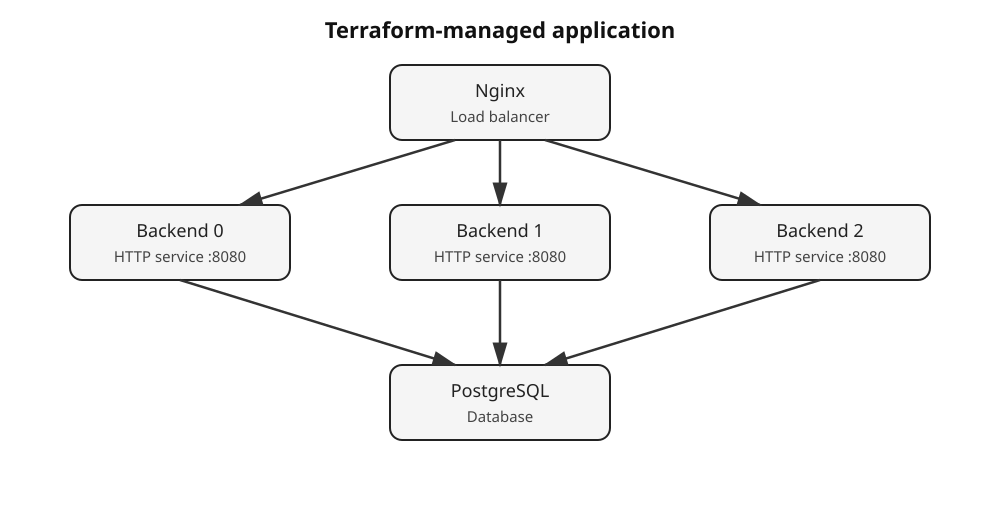
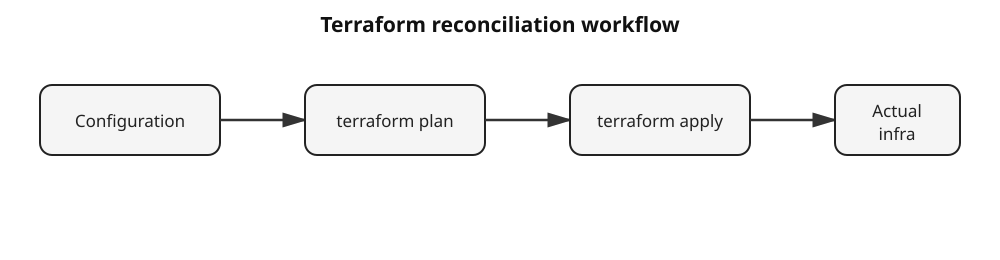

# Terraform Infrastructure as Code

## Scenario

You are a DevOps engineer responsible for a small web application.

The application starts with a single backend service and a PostgreSQL database. Your job is to turn the infrastructure into **Infrastructure as Code (IaC)** using Terraform.

During the scenario you will deliberately create infrastructure drift, repair it through Terraform, and then evolve the architecture by scaling the backend from one container to three and adding Nginx load balancing.

### Final architecture



```text
                         Nginx
                      load balancer
                           |
              +------------+------------+
              |            |            |
              v            v            v
         backend-0     backend-1     backend-2
              |            |            |
              +------------+------------+
                           |
                           v
                       PostgreSQL
```

## Learning outcomes

After completing this scenario, you will be able to:

1. Explain the role of Infrastructure as Code in DevOps.
2. Describe Terraform's declarative approach to infrastructure.
3. Provision a multi-container application with Terraform.
4. Explain Terraform resources, dependencies and state.
5. Use `terraform plan` and `terraform apply` to reconcile infrastructure.
6. Identify and repair configuration drift.
7. Change desired infrastructure from one backend instance to three.
8. Explain how a reverse proxy can distribute traffic across replicas.
9. Evaluate when Terraform is useful and where its responsibilities should end.

## Terraform workflow



## How the lab works

You will use a Docker host provided by Killercoda. Terraform will manage Docker through the Docker API.

The tutorial intentionally alternates between:

**Concept → action → observation → explanation**

so that the infrastructure concepts are demonstrated rather than only described.

> **Important:** Run commands in the terminal as instructed. When a step has a **CHECK** button, use it to verify your result before continuing.
