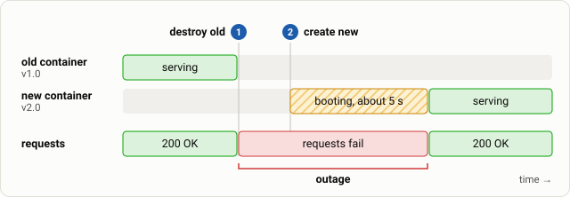

# Step 2: Observe the outage

**Goal:** reproduce the problem with the default behaviour and read the plan that predicts it.

An "upgrade" is just a change of the version in code:

```bash
echo 'app_version = "2.0"' > terraform.tfvars
terraform plan
```{{exec}}

Find the line for `docker_container.app`. It is marked `-/+` and says **destroy and then create replacement**. That sentence is the whole problem: the old container disappears *before* the new one exists, and then the new one needs 5 more seconds to boot.



*The plan as a timeline: for as long as no container is ready, every request fails.*

Apply it:

```bash
terraform apply -auto-approve
```{{exec}}

When the apply has finished, record the result:

```bash
score "step 2: default order"
```{{exec}}

Expect dozens of failed requests and an outage of several seconds (your numbers will differ slightly). Terraform reported success, but users would have seen errors. If `monitor` is running in your second tab, it shows the same outage as a block of failing seconds between the `v1.0` line and the `v2.0` line.

**Why does Terraform do this?** Many resources cannot exist twice at once: a fixed name, a published port, a single license, a volume. Destroy-first is the safe default because it never needs two copies. It is correct for those cases and wrong for a load-balanced service.
