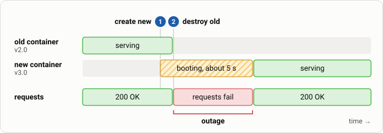

# Step 3: Fix the order with `create_before_destroy`

**Goal:** make Terraform start the new container *before* removing the old one, and learn what that requires.

First the obvious change: add this to the container.

```diff
+  lifecycle {
+    create_before_destroy = true
+  }
```

Put it in place together with the next version (the `diff` shows what changes in `main.tf`):

```bash
diff -u main.tf stages/stage3a.tf
cp stages/stage3a.tf main.tf
echo 'app_version = "3.0"' > terraform.tfvars
```{{exec}}

Apply it:

```bash
terraform apply -auto-approve
```{{exec}}

**It fails** with an error saying the container name is already in use. The container is named `app`, and during the overlap two containers would both be called `app`. Check that nothing was damaged: a failed create-first apply leaves the old container serving.

```bash
docker ps --format '{{.Names}}'; curl -s localhost:8080
```{{exec}}

(This is itself a benefit: with destroy-first, a failed create would have left you with *nothing*.)

**Fix:** make each generation of the container uniquely named. A `terraform_data` "release marker" gets a new id whenever the version changes, and we use that id in the name:

```diff
+resource "terraform_data" "release" {
+  triggers_replace = [var.app_version]
+}
 resource "docker_container" "app" {
-  name  = "app"
+  name  = "app-${substr(terraform_data.release.id, 0, 8)}"
```

```bash
diff -u main.tf stages/stage3b.tf
cp stages/stage3b.tf main.tf
```{{exec}}

Apply again:

```bash
terraform apply -auto-approve
```{{exec}}

This time the apply succeeds. Record the result:

```bash
score "step 3: create_before_destroy"
```{{exec}}

**Result:** the order is now create, then destroy, but you should *still* see failures. The new container counts as "created" as soon as it is *running*, and the old one is removed right away, yet the app inside needs 5 seconds before it can answer. Fixing the order was necessary but not sufficient.



*The order is right, but Terraform moves on as soon as the new container is running. The outage shrinks to roughly the boot time of the app.*

Lesson: a fix can introduce a new constraint (unique names), and Terraform's idea of "done" is not the same as "ready for traffic".
