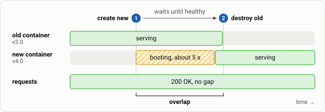

# Step 4: Fix readiness with a health check

**Goal:** make Terraform wait until the new container is actually ready before it removes the old one.

```diff
+  healthcheck {
+    test     = ["CMD", "wget", "-q", "-O", "/dev/null", "http://127.0.0.1:8080/health"]
+    interval = "1s"
+    timeout  = "2s"
+    retries  = 3
+  }
+
+  wait         = true
+  wait_timeout = 60
```

- `healthcheck` tells **Docker** how to decide the app is ready.
- `wait = true` tells **Terraform** to block until Docker reports *healthy*. Combined with `create_before_destroy`, the old container is only removed after the new one passes its check.



*Terraform now holds on to the old container until the new one is healthy. For a few seconds both run side by side, so there is no moment without a ready container.*

Put the change in place together with the next version:

```bash
diff -u main.tf stages/stage4.tf
cp stages/stage4.tf main.tf
echo 'app_version = "4.0"' > terraform.tfvars
```{{exec}}

Apply it:

```bash
terraform apply -auto-approve
```{{exec}}

Record the result:

```bash
score "step 4: + health check"
```{{exec}}

Notice that `apply` now takes a few seconds longer: that is Terraform waiting. The failure count should be **0 or close to it**. In the monitor, this rollout has no failing block. You see the `v3.0` line, usually a short line with `v3.0,v4.0` (the overlap, while both containers answer), and then the `v4.0` line.

If you still see one to three failures, that is a real limit, not a mistake: a request that was already in flight to the old container when it stopped can still fail. Terraform controls *ordering*; it does not drain connections. We come back to this in the last step.
